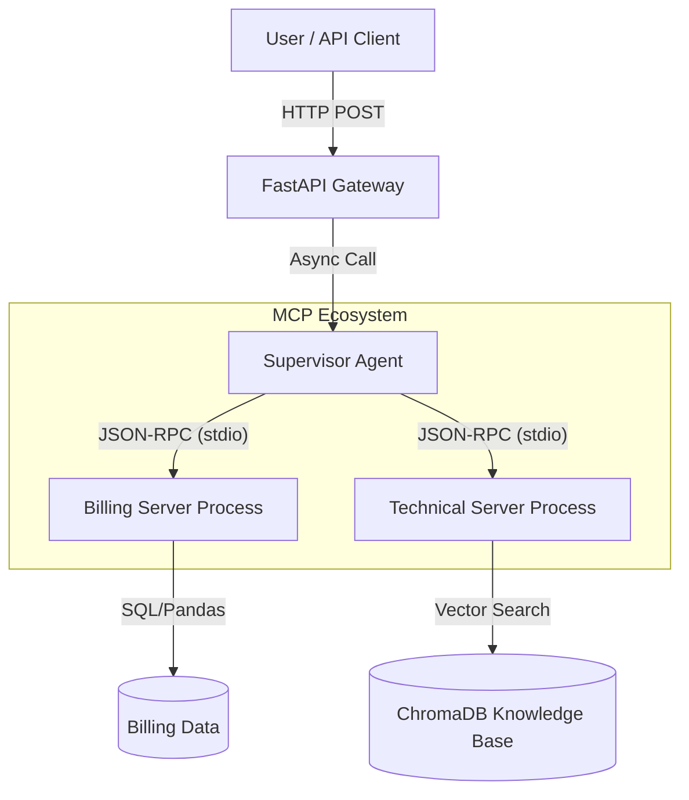

# 🦅 Project Sentinel: Autonomous AI for Telecom Operations

**Sentinel** is an advanced Multi-Agent System designed to autonomously detect anomalies and resolve technical incidents in a Telecom environment.
Built with **FastAPI**, **RAG (Retrieval-Augmented Generation)**, and the **Model Context Protocol (MCP)**, it demonstrates a cutting-edge "Agentic Workflow" where intelligence is decoupled from tooling.

Repository: [https://github.com/2YoY2/Sentinel](https://github.com/2YoY2/Sentinel)

---

## 🚀 Key Features

### 1. 🧠 The "Supervisor" (Orchestrator)
-   **Role**: The Brain.
-   **Capability**: Analyzes natural language queries to determine intent (Billing vs. Technical).
-   **Tech**: Custom MCP Client managing subprocesses.

### 2. 🕵️‍♀️ The "Billing Agent" (Analyst)
-   **Role**: The Data Scientist.
-   **Capability**: Detects "Weak Signals" (Churn Risk) and Billing Anomalies.
-   **Method**: Uses statistical Z-Score analysis on historical billing data.
-   **Architecture**: Runs as a standalone **MCP Server**.

### 3. 🔧 The "Technical Agent" (Support)
-   **Role**: The Engineer.
-   **Capability**: Solves technical issues by consulting a knowledge base.
-   **Method**: **RAG** (Retrieval-Augmented Generation) using `ChromaDB` and `SentenceTransformers`.
-   **Architecture**: Runs as a standalone **MCP Server**.

---

## 🛠️ Architecture

The system follows a **Micro-Agent Pattern** using the Model Context Protocol (MCP):



---

## 📦 Installation

### Prerequisites
-   Python 3.10+
-   Docker (Optional, for containerization)

### Setup
1.  Clone the repository:
    ```bash
    git clone https://github.com/your-repo/sentinel.git
    cd Sentinel
    ```

2.  Install dependencies:
    ```bash
    pip install -r requirements.txt
    ```

---

## 🚦 Usage

### 1. Generate Synthetic Data
First, create the "World" (Customers, Bills, Incidents):
```bash
python src/generator.py
```
*This creates `data/customers.csv`, `data/billing.csv`, etc.*

### 2. Run the Sentinel Brain (API)
Start the FastAPI server. This **automatically** launches the sub-agents (MCP Servers).
```bash
python src/api.py
```
*Server running at http://127.0.0.1:8000*

### 3. Test the System
Send a request that requires multi-agent collaboration:
```bash
curl -X POST "http://127.0.0.1:8000/analyze" \
     -H "Content-Type: application/json" \
     -d '{"customer_id": "CUST_0001", "message": "My bill is huge! And my internet is very slow in Zone B."}'
```
**Expected Response:**
```json
{
  "response": "⚠️ BILLING ALERT: Bill is €175 (Avg: €50)... \n\n🔧 Technical Support: Update router firmware...",
  "status": "success"
}
```

---

## ☁️ Deployment (Docker & Kubernetes)

### Docker
Build the container:
```bash
docker build -t sentinel-agent:latest .
```

### Kubernetes
Deploy to your cluster (or Minikube):
```bash
kubectl apply -f k8s/deployment.yaml
```

---

## 📂 Project Structure

```text
Sentinel/
├── src/
│   ├── api.py              # FastAPI Entrypoint
│   ├── supervisor_mcp.py   # MCP Client (The Brain)
│   ├── servers/            
│   │   ├── billing_server.py # MCP Server (Billing Logic)
│   │   └── tech_server.py    # MCP Server (RAG Logic)
│   ├── billing_agent.py    # Core Billing Logic (Pandas)
│   └── tech_agent.py       # Core Tech Logic (ChromaDB)
├── data/                   # Generated CSVs and Knowledge Base
├── k8s/                    # Kubernetes Manifests
├── Dockerfile              # Container Recipe
└── requirements.txt        # Python Dependencies
```
